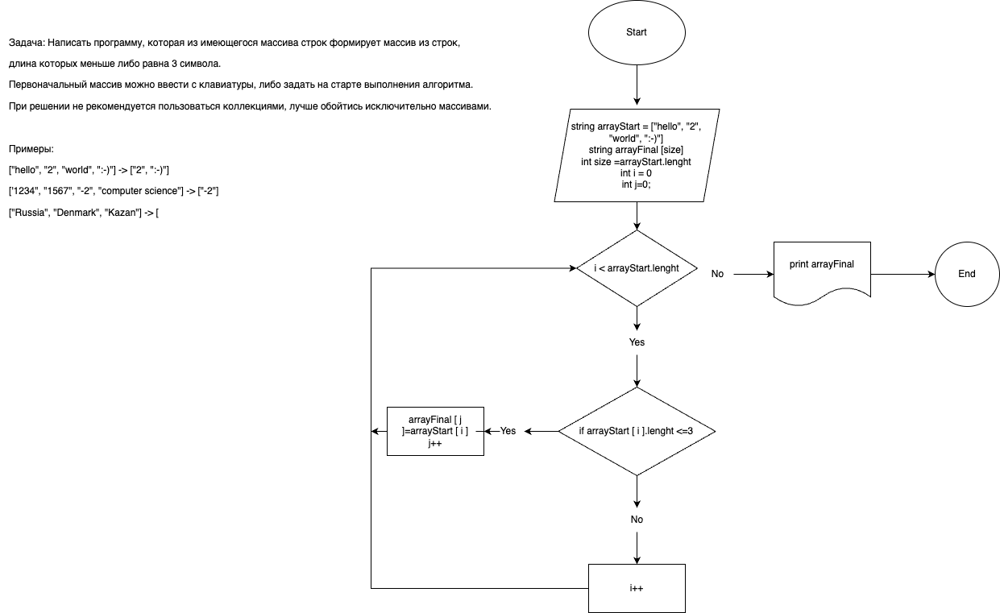

# Итоговая проверочная работа.
## В ходе данной проверочной работы решаются следующие задачи
1. Создать репозиторий на GitHub
    > Адрес созданного репозитория: [Репозиторий контрольной работы](https://github.com/D-Grigoryev/FinalProject---1st-quarter "Репозиторий контрольной работы") 
2. Нарисовать блок-схему алгоритма (можно обойтись блок-схемой основной содержательной части, если вы выделяете ее в отдельный метод)

    > Блок схема работы алгоритма 


3. Снабдить репозиторий оформленным текстовым описанием решения (файл README. md)
>>Данный пункт выполнен по ходу решения задачи
4. Написать программу, решающую поставленную задачу

```string[] arrayStart = new string[] { "hello", "2", "world", ":-)"};
string [] checkArrayElement (string [] arrStart)
{
    int j = 0;
    int count = 0;
    for (int i = 0; i < arrayStart.Length; i++)
{
    if (arrStart[i].Length <= 3){
        j++;
    }
}
string[] arrayFinal = new string[j];
for (int i = 0; i < arrayStart.Length; i++)
{
    if (arrStart[i].Length <= 3){
    arrayFinal [count] = arrStart[i];
    count++;
}
}return arrayFinal;
}
void printArray (string [] arr){
for (int i = 0; i < arr.Length; i++)
{
    Console.Write($"{arr[i]} ");
}
}
printArray(checkArrayElement(arrayStart));
```